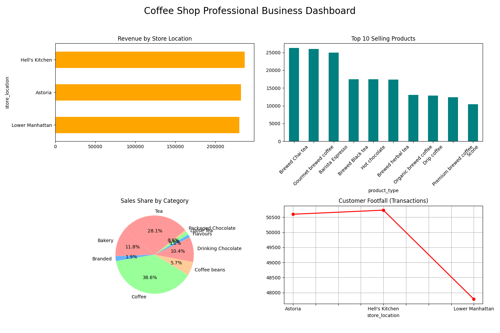

# ☕ Coffee Shop Sales Analysis & Dashboard

A comprehensive data analysis project using **Python**, **Pandas**, and **Matplotlib** to derive actionable business insights from coffee shop sales data.

## 📌 Project Overview
The goal of this project was to analyze transaction data from a coffee shop chain to identify sales trends, top-performing products, and revenue distribution across different locations.

## 🚀 Key Business Insights
After processing the dataset, the following key insights were discovered:
* **Top Revenue Generator:** The `Hell's Kitchen` location leads in total sales, contributing over **$236,000**.
* **Best Selling Product:** `Brewed Chai Tea` is the most popular item with over **26,000** units sold.
* **Category Analysis:** Coffee and Tea categories together account for nearly **70%** of the total business volume.
* **Customer Footfall:** Analyzed peak transaction times to understand store busy periods.

## 🛠️ Tech Stack
* **Data Manipulation:** Python, Pandas
* **Data Visualization:** Matplotlib
* **Environment:** VS Code

## 📊 Visual Dashboard
The following dashboard was generated automatically using the Python script to visualize the business performance:

## 📂 Project Structure
* `main.py`: The core Python script containing the analysis and visualization code.
* `Coffee_Shop_Sales.csv.csv`: The raw dataset containing transaction records.
* `Full_Business_Dashboard.png`: The final exported visual report.

## ⚙️ How to Run
1. Clone this repository.
2. Install dependencies: `pip install pandas matplotlib`
3. Run the analysis: `python main.py`

